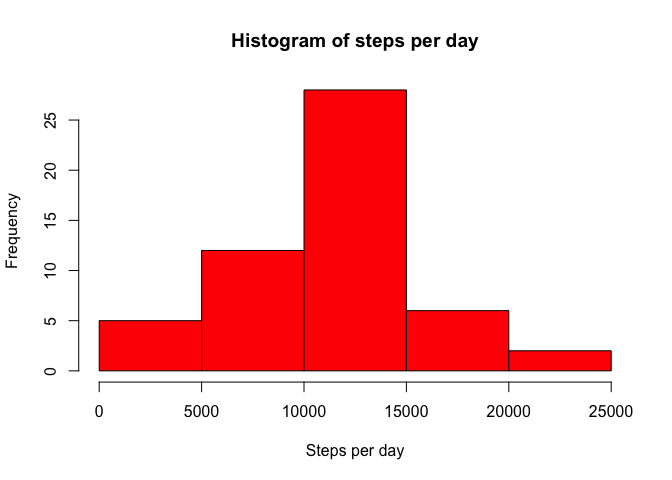
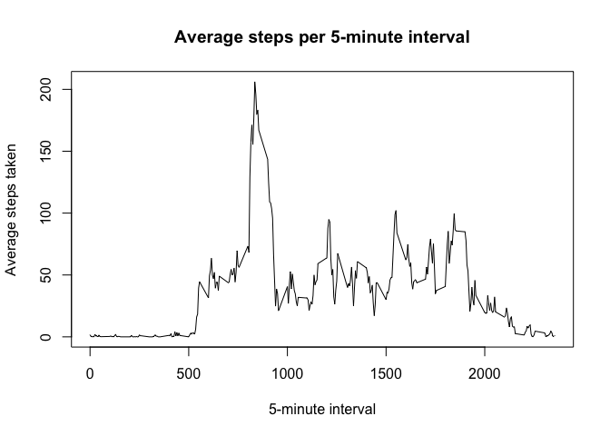
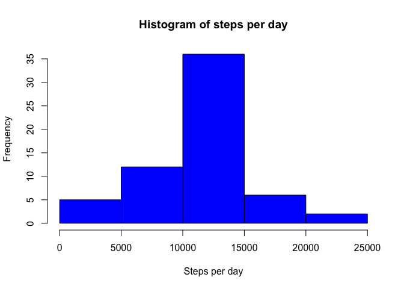
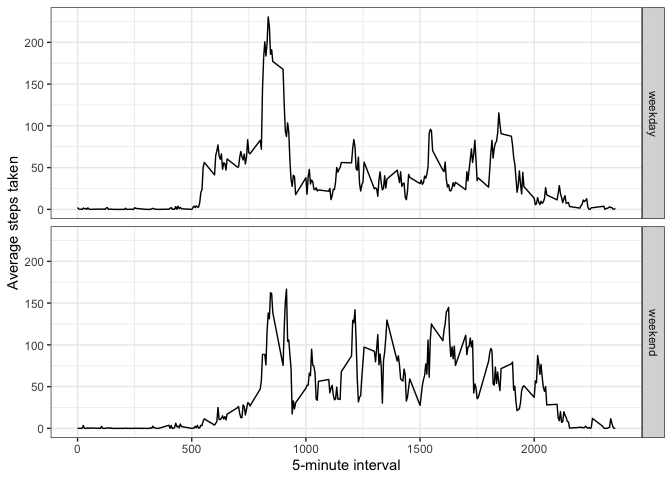

## Summary of results

In this report, we answer several questions:

1. *What is the mean total number of steps taken per day?* When we ignore missing values,
the mean number of total steps per day is **10766.19**, and the median is **10765**.
2. *What is the average daily activity pattern?* The average steps taken is near zero for 
the 5-minute intervals up to 500. Then, the average steps increases with some noise until the maximum at interval 835. The average steps then sharply decline before interval 1000. 
After this, they vary noisily between about 25 and 100 steps until around interval 2000 when they 
decline towards the initial phase.  
3. *Which 5-minute interval, on average across all the days in the dataset, contains the maximum number of steps?* On average, the maximum number of steps is in interval **835**.
4. *What are the mean and median total number of steps taken per day after imputation? Do these values differ from the estimates from the first part of the assignment? What is the impact of imputing missing data on the estimates of the total daily number of steps?* After imputation of
the 2304 missing values, the mean number of total steps per day is **10766.19**, and the median is also **10766.19**. The mean is the same regardless of if we ignore missing values or use imputation, but the median increases to match the mean. This is due to the addition of several days with the mean number
of steps for the imputed data set versus the data set ignoring missing values.
5. *Are there differences in activity patterns between weekdays and weekends?* From the time
series, we observe that activity earlier in the day is higher during the weekdays than the
weekends, and later day activity is higher during the weekends.

Thorough justification for these answers follows in the body of this report.

## Loading and preprocessing the data

### Loading

To begin, we unzip the *activity.zip* file, found in the forked repository:

```r
    unzip("activity.zip", exdir =".")
```

Next, we load in the data from the unzipped file, *activity.csv*:

```r
    AMD <- read.csv("activity.csv", header = TRUE)
```
The variable abbreviation "AMD" stands for "Activity monitoring data".

### Preprocessing

Before analyzing our data, we take a look at the structure of `AMD`:

```r
    str(AMD)
```

```
## 'data.frame':	17568 obs. of  3 variables:
##  $ steps   : int  NA NA NA NA NA NA NA NA NA NA ...
##  $ date    : chr  "2012-10-01" "2012-10-01" "2012-10-01" "2012-10-01" ...
##  $ interval: int  0 5 10 15 20 25 30 35 40 45 ...
```

The dimensions match the description of the data set, with 17,568 observations and 
3 variables. However, we would prefer the `date` variable to be of the class Date instead of character. Therefore, we convert the date character strings into Date using `as.Date`:

```r
    AMD$date <- as.Date(AMD$date, format = "%Y-%m-%d")
```

To confirm our conversion worked, we check the `class` of `AMD$date`:

```r
    class(AMD$date)
```

```
## [1] "Date"
```

Using `sum` and `is.na`, we can check for missing values:

```r
    c(steps = sum(is.na(AMD$steps)), interval = sum(is.na(AMD$interval)),
    date = sum(is.na(AMD$date)))
```

```
##    steps interval     date 
##     2304        0        0
```
We see that there are only missing values for the `steps` variable, coded as `NA`.

### Package installation
The package `dplyr` will be used in subsequent steps. For the convenience of the
reader, the following code will install `dplyr` if it is not already installed. 
Then, the code loads `dplyr`.

```r
    pckglist <- rownames(installed.packages()) 
    if(!("dplyr" %in% pckglist)) {install.packages("dplyr")} 
    library(dplyr)
```

Similarly, for the last question, the package `ggplot2` is used for graphing. 
The following code will install `ggplot2` if it is not already installed.

```r
    pckglist <- rownames(installed.packages()) 
    if(!("ggplot2" %in% pckglist)) {install.packages("ggplot2")} 
```

## What is mean total number of steps taken per day?

In order to answer this question, we determine the total number of steps taken 
per day, make a histogram of this result, and then calculate the mean and median.
Note that for this section, we ignore the missing values in the dataset.

To begin, we use `dplyr` to remove any records where the `steps` variable is `NA`,
group by day and calculate the total number of steps taken per day:

```r
    num_steps <- AMD %>%
    filter(!is.na(steps)) %>% # remove missing values
    group_by(date) %>% # group by day
    summarize(dailysteps = sum(steps)) # sum total steps per day
```

In order to get a sense of the distribution of the total number of steps per day, we
create a histogram of this new variable:

```r
    hist(num_steps$dailysteps, col = "red",
         xlab = "Steps per day", main = "Histogram of steps per day")
```

<!-- -->

Now, we calculate the mean and median of `dailysteps`, the total number of steps
per day.

```r
    dsmean <- mean(num_steps$dailysteps)
    dsmed <- median(num_steps$dailysteps)
```

```r
    dsmean
```

```
## [1] 10766.19
```

```r
    dsmed
```

```
## [1] 10765
```

Hence, we determine that the mean number of total steps per day is
**10766.19**, and  the median is 
**10765**. Looking at the above histogram, this seems reasonable.

## What is the average daily activity pattern?

We use `dplyr` to summarize the original data frame and determine the average steps
per time interval:

```r
    avg_steps <- AMD %>%
    filter(!is.na(steps)) %>% # remove missing values
    group_by(interval) %>% # group by 5-minute interval
    summarize(avgsteps = mean(steps)) # find the average number of steps in each interval
```
Note that for this section we again had to ignore missing values, since otherwise the
averages would all be `NA`.

Now, we can make a time series plot of the average number of steps taken per 
5-minute interval:

```r
    plot(avg_steps$interval, avg_steps$avgsteps, type = "l",
         main = "Average steps per 5-minute interval", xlab = "5-minute interval",
         ylab = "Average steps taken")
```

<!-- -->

Given the time series plot, it seems that the 5-minute interval with the highest
number of average steps taken is somewhere in 800-1000. We find the exact interval
using the `which.max` function:

```r
    avg_steps$interval[which.max(avg_steps$avgsteps)]
```

```
## [1] 835
```
The number of average steps across all days in this interval is

```r
    max(avg_steps$avgsteps)
```

```
## [1] 206.1698
```
We see that the maximum number of average steps across all the days occurs in interval
**835**, with an average of **206.17** steps taken.

## Imputing missing values

As shown in the preprocessing subsection in the first section, some of the records
have missing values for steps. We saw that the missing values of `NA` appear in
the steps variable, and we can easily verify that there are **2304** records
with missing values:

```r
    sum(is.na(AMD$steps))
```

```
## [1] 2304
```

### Determining a imputation strategy

In order to compare the proportion of days that have no missing values versus 
the proportion of intervals with no missing values, we use `dplyr` to create some
summary data frames.

First, for the days, we compare two data frames. The first (used in an earlier section),
has missing values filtered out, while the second does not.

```r
    num_steps <- AMD %>%
    filter(!is.na(steps)) %>%
    group_by(date) %>%
    summarize(dailysteps = sum(steps))
    dim(num_steps) # dimension of summary data frame without missing values
```

```
## [1] 53  2
```

```r
    num_steps2 <- AMD %>%
    group_by(date) %>%
    summarize(dailysteps = sum(steps))
    dim(num_steps2) # dimension of summary data frame with missing values
```

```
## [1] 61  2
```
Comparing the dimensions of the two data frames, we see that there are 8 days with all
steps values missing.

Second, for the intervals, we again compare two data frames, one without missing
values (used in a previous section) and the second with missing values.

```r
    avg_steps <- AMD %>%
    filter(!is.na(steps)) %>%
    group_by(interval) %>%
    summarize(avgsteps = mean(steps))
    dim(avg_steps) # dimension of summary data frame without missing values
```

```
## [1] 288   2
```

```r
    avg_steps2 <- AMD %>%
    group_by(interval) %>%
    summarize(avgsteps = mean(steps))
    dim(avg_steps2) # dimension of summary data frame with missing values
```

```
## [1] 288   2
```
Hence, there are no intervals with all missing values.

Therefore, since there are days which have only missing values but all intervals
in the original data set have at least one valid number of steps, then we choose to use the mean number of steps for the corresponding 5-minute interval for imputation, since we have a mean for every one of the 288 5-minute intervals.

### Implementing imputation strategy

In order to implement the imputation strategy, we want to take the original `AMD`
data frame and replace any missing value by looking up the corresponding mean
number of steps from the `avg_steps` data frame.

To do so, we loop through the `AMD` data frame. For each iteration, we check if
the number of steps is `NA`. If it is, we find which the row of the `avg_steps` data frame
corresponding to the interval, and then we replace the `NA` with the appropriate
average.

```r
    curr_row <- 1 # initializing current row
    max_row <- nrow(AMD) # finding last row in AMD
    while(curr_row < max_row + 1) { # looping through AMD
        if(is.na(AMD[curr_row, 1])) { # check if the steps is missing
            curr_int <- AMD[curr_row, 3] # finding interval corresponding to missing steps
            AS_row <- which(avg_steps$interval == curr_int) # finding corresponding row in avg_steps
            AMD[curr_row,1] <- avg_steps$avgsteps[AS_row] # replacing NA with average
        }  
        curr_row <- curr_row + 1 # next row
    }
```

We check to make sure we have no missing values now:

```r
    any(is.na(AMD$steps))
```

```
## [1] FALSE
```

The interval averages should also not have changed:

```r
    avg_steps3 <- AMD %>%
    group_by(interval) %>%
    summarize(avgsteps = mean(steps))
    identical(avg_steps, avg_steps3) # are the interval averages the same?
```

```
## [1] TRUE
```

Given there are no longer missing values, and that the imputation did not modify
the interval averages, we are fairly confident the imputation code did not introduce
any errors.

### Histogram, mean, and median

We repeat the total number of steps calculations we did for the non-imputed data set.
First, we use `dplyr` to group by day and calculate the total steps per day:


```r
    num_steps_imp <- AMD %>%
    group_by(date) %>%
    summarize(dailysteps = sum(steps))
```

Second, we create a histogram of the daily steps:

```r
    hist(num_steps_imp$dailysteps, col = "blue",
         xlab = "Steps per day", main = "Histogram of steps per day")
```

<!-- -->

Third, we calculate the mean and median of `dailysteps`, the total number of steps
per day, for the imputed data set:

```r
    dsmean_imp <- mean(num_steps_imp$dailysteps)
    dsmed_imp <- median(num_steps_imp$dailysteps)
```

```r
  dsmean_imp
```

```
## [1] 10766.19
```

```r
  dsmed_imp
```

```
## [1] 10766.19
```

For the imputed data set, the mean number of total steps per day is
**10766.19**, and the median is 
**10766.19**. 
For the non-imputed data set, the mean number of total steps per day was
**10766.19**, and the median was 
**10765**. Therefore, while imputation did not
modify the mean, it did adjust the median to be equal to the mean, increasing the median by approximately 1.19.

This is likely because this imputation strategy essentially replaced any missing
days with an "average day", and therefore the average was not impacted. However, doing
so added 8 repetitions of 10766.19 to the ordered vector of `dailysteps`, which shifted
the median up to one of these repetitions from 10765. We can observe this shift by considering
the change in the y-axis scale of the histograms (between the original and imputed data sets),
since the middle value is now more frequent.
    
## Are there differences in activity patterns between weekdays and weekends?

In order to compare the activity patterns between weekdays and weekends, we introduce
a new factor variable to split the imputed data set based on whether the day is during
the work week or weekend. Note that given we directly modified the `AMD` data set in the 
prior section, the data set used here is the imputed data set.

We add the factor variable `daytype` to the `AMD` data set, again using a `while` loop.
We classify Monday through Friday as weekday days, and Saturday and Sunday as the weekend.

```r
    weekfactor <- c()
    curr_row <- 1 # initializing current row
    max_row <- nrow(AMD) # finding last row in AMD
    while(curr_row < max_row + 1) { # looping through AMD
        dt <- weekdays(AMD[curr_row,2]) # find what day of the week the date is
        if (dt %in% c("Monday", "Tuesday", "Wednesday", "Thursday", "Friday")) { # weekday
            weekfactor <- c(weekfactor, "weekday")
        } else {
            weekfactor <- c(weekfactor, "weekend") # otherwise weekend
        }
        curr_row <- curr_row + 1 # next row
    }
    AMD$daytype <- as.factor(weekfactor) # add column to data frame
```

The data comes from October and November, 2012. In October 2012, there were 
23 weekday days, and 8 weekend days. In November 2012, there were 22 weekday days,
and 8 weekend days. Therefore, over these two months, we should have 45 weekday days,
and 16 weekend days. Thus, we expect our number of weekday observations to be 2.8125 
times the number of weekend observations. We verify that this is indeed the case by tabulating the `daytype` variable.

```r
    table(AMD$daytype)
```

```
## 
## weekday weekend 
##   12960    4608
```
A quick calculation confirms that there are 2.8125 times as many weekday observations
as weekend observations, as expected.

Now, we take this expanded, imputed `AMD` data frame and find the average number of 
steps taken per 5-minute interval within a day type (weekday or weekend).

```r
    avg_steps_impWD <- AMD %>%
    group_by(interval, daytype) %>% # group by both 5-minute interval and weekday vs weekend
    summarize(avgsteps = mean(steps), .groups = "keep")
    avg_steps_impWD # print result 
```

```
## # A tibble: 576 x 3
## # Groups:   interval, daytype [576]
##    interval daytype avgsteps
##       <int> <fct>      <dbl>
##  1        0 weekday  2.25   
##  2        0 weekend  0.215  
##  3        5 weekday  0.445  
##  4        5 weekend  0.0425 
##  5       10 weekday  0.173  
##  6       10 weekend  0.0165 
##  7       15 weekday  0.198  
##  8       15 weekend  0.0189 
##  9       20 weekday  0.0990 
## 10       20 weekend  0.00943
## # … with 566 more rows
```

We create the time series plots of the average number of steps taken per 5-minute interval
for both weekdays and weekends:

```r
    library(ggplot2)
    daytypeplot <- ggplot(data = avg_steps_impWD, aes(interval, avgsteps)) # initial ggplot call
    daytypeplot + facet_grid(rows = avg_steps_impWD$daytype) + geom_line() + # add line and facets
        xlab("5-minute interval") + ylab("Average steps taken") + theme_bw() # add labels and change theme
```

<!-- -->

We see that the "weekday" plot more closely matches the original. This 
is expected since there are 2.8125 times as many observations as for the weekend
and so weekday observations dominate weekend observations. The activity appears to be higher during the weekday earlier in the day, and higher during the weekend later in the day.

